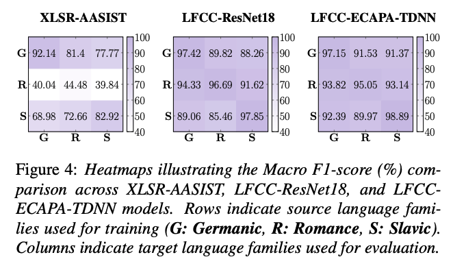

# 🌐 Multilingual Source Tracing of Speech Deepfakes: A First Benchmark


(Accepted at Interspeech SPSC 2025-Oral 🇳🇱🎙) 

[](https://www.arxiv.org/abs/2508.04143) [[slides](https://beaverton-my.sharepoint.com/personal/xixuan3_um_cityu_edu_hk/Documents/Interspeech25_SPSC_PPT_Xi_Xuan.pdf?CT=1756894314188&OR=ItemsView)]

📅 Presentation Details:
*   **🎙️ Speaker:** Xi Xuan
*   **🗓️ Date:** Saturday, August 16th, 2025
*   **🕚 Time:** 11:15 – 12:15
*   **📍 Location:** Aula Conference Center, TU Delft, Netherlands 🇳🇱

---

Official PyTorch Implementation: Multilingual Source Tracing of Speech Deepfakes: A First Benchmark 🕵️‍♂️🔍

Authors: Xi Xuan, Yang Xiao, Rohan Kumar Das, Tomi Kinnunen


## 📌 Abstract

Recent progress in generative AI has made it increasingly easy to create natural-sounding deepfake speech from just a few seconds of audio. While these tools support helpful applications, they also raise serious concerns by making it possible to generate convincing fake speech in many languages. Current research has largely focused on detecting fake speech, but little attention has been given to tracing the source models used to generate it. This paper introduces the first benchmark for multilingual speech deepfake source tracing, covering both mono- and cross-lingual scenarios. We comparatively investigate DSP- and SSL-based modeling; examine how SSL representations fine-tuned on different languages impact cross-lingual generalization performance; and evaluate generalization to unseen languages and speakers. Our findings offer the first comprehensive insights into the challenges of identifying speech generation models when training and inference languages differ. 

## 🚀 Getting Started

### 📥 1. Download MCL-MLAAD Dataset

MCL-MLAAD is based on the [MLAAD dataset](https://deepfake-total.com/sourcetracing).  
MCL-MLAAD is available at [MCL-MLAAD dataset](https://huggingface.co/datasets/xxuan-speech/MCL-MLAAD).
It includes **six languages** from three language families:  

- **Germanic**: English 🇬🇧, German 🇩🇪  
- **Romance**: French 🇫🇷, Italian 🇮🇹  
- **Slavic**: Polish 🇵🇱, Russian 🇷🇺  

This dataset is designed for **Multilingual Source Tracing**, covering both **mono-lingual** and **cross-lingual** scenarios, and further explores the impact of **unseen languages** and **speakers**.

Following this paper’s protocol, each audio file is augmented with **musan+rirs** (four noise types: noise, music, babble, reverberation) and used to extract DSP/SSL features for training **AASIST / ResNet / ECAPA-TDNN**.

- **MCL-MLAAD (LFCC+4noise)** → preprocessed `.pt` files for LFCC + AASIST / ResNet / ECAPA-TDNN (LFCC_add_noise/preprocess_lfcc folder)

- **MCL-MLAAD (no feature+4noise)** → preprocessed `.pt` files for different SSL + AASIST  (Clean_no_feature folder)


### 📂 2. Download Protocols (mapping to paper Section 2.2)

There are **three main protocol folders** under the Hugging Face dataset.  
Each subsection in the paper maps to one of these folders:

#### 🔹 2.2.1 Mono- & Cross-Lingual Protocol  
#### 🔹 2.2.2 Mono- & Cross Language Family Protocol  
#### 🔹 2.2.3 Seen & Unseen Languages Protocol  

👉 Use files under **Languages Protocol**  
 [Languages Protocol](https://huggingface.co/datasets/xxuan-speech/Multilingual_Source_Tracing_Protocals/tree/main/Languages%20Protocol)

#### 🔹 2.2.4 Seen & Unseen Speakers Protocol  

👉 Use files under **Seen & Unseen Speakers Eval Protocol**  
 [Seen & Unseen Speakers Eval Protocol](https://huggingface.co/datasets/xxuan-speech/Multilingual_Source_Tracing_Protocals/tree/main/Seen%20%26%20Unseen%20Speakers%20Eval%20Protocol)

#### 🔹 Complete Protocol with Pseudo-Speaker Labels  

- Labels combine **language + speaker-id**.  
- Generated via our **pseudo-speaker labeling method** (see script: [inference_extract_speaker_emb.py](https://github.com/xuanxixi/Tools/blob/main/inference_extract_speaker_emb.py))  
- Embeddings are clustered using **spherical k-means** to obtain pseudo-speaker IDs. (see details in Section 2.2.4 of the paper)  
- Data stored under **Languages+Speakers Protocol**  

 [Languages+Speakers Protocol](https://huggingface.co/datasets/xxuan-speech/Multilingual_Source_Tracing_Protocals/tree/main/Languages%2BSpeakers%20Protocol)


### 3. DSP Models

All DSP front-ends include LFCC, implemented using [](https://docs.pytorch.org/audio/main/generated/torchaudio.transforms.LFCC.html).


### 4. SSL Models

All SSL front-ends include two foundation models: wav2vec2.0 Large LV-60 and XLS-R-300M. Language-specific fine-tuned variants are based on large-xlsr-53, trained on six languages (en, de, fr, it, pl, ru).  

| Name              | Pretraining Dur. (h) | Pretraining Langs. | Fine-tuning Lang. | Datasets        | Hugging Face Link |
|-------------------|----------------------|--------------------|-------------------|-----------------|-------------------|
| **wav2vec2**      |                      |                    |                   |                 |                   |
| 1. large-lv60     | 53k                  | en                 | --                | LL              | [](https://huggingface.co/facebook/wav2vec2-large-lv60) |
| 2. xls-r-300m     | 436k                 | many               | --                | CV, BBL, MLS, VP, VL | [](https://huggingface.co/facebook/wav2vec2-xls-r-300m) |
| **Fine-tuned variants** |             |                    |                   |                 |                   |
| 3. large-xlsr-53-en | 56k                | many               | en                | CV-en           | [](https://huggingface.co/jonatasgrosman/wav2vec2-large-xlsr-53-english) |
| 4. large-xlsr-53-de | 56k                | many               | de                | CV-de           | [](https://huggingface.co/jonatasgrosman/wav2vec2-large-xlsr-53-german) |
| 5. large-xlsr-53-fr | 56k                | many               | fr                | CV-fr           | [](https://huggingface.co/jonatasgrosman/wav2vec2-large-xlsr-53-french) |
| 6. large-xlsr-53-it | 56k                | many               | it                | CV-it           | [](https://huggingface.co/jonatasgrosman/wav2vec2-large-xlsr-53-italian) |
| 7. large-xlsr-53-pl | 56k                | many               | pl                | CV-pl           | [](https://huggingface.co/jonatasgrosman/wav2vec2-large-xlsr-53-polish) |
| 8. large-xlsr-53-ru | 56k                | many               | ru                | CV-ru           | [](https://huggingface.co/jonatasgrosman/wav2vec2-large-xlsr-53-russian) |

**Datasets Key**:  
- Librispeech (LL) [¹](https://ieeexplore.ieee.org/document/7178964)  
- CommonVoice (CV) [²](https://arxiv.org/abs/1912.06670)  
- BABEL (BBL) [³](https://www.isca-archive.org/sltu_2014/gales14_sltu.pdf)  
- Multilingual Librispeech (MLS) [⁴](https://arxiv.org/abs/2012.03411)  
- VoxPopuli (VP) [⁵](https://arxiv.org/abs/2101.00390)  
- VoxLingua107 (VL) [⁶](https://arxiv.org/abs/2011.12998)


### 🧰 5. Install Dependencies

Install all required dependencies from the `requirements.txt` file. The baseline was developed and tested using Python 3.11.

```bash
pip install -r requirements.txt
```
### 6. Training

#### Table 4 — Main Experiments

Run:

```bash
python main_train.py
```

#### Figure 4 — Language-Family Experiments

Run:

```bash
python family_train.py
```

#### Tables 5 & 6 — Leave-One-Language-Out (LOLO) Experiments

Run:

```bash
python 5language_train.py
```


### 7. Inference

### 8. Results


# ✍️ Citation
If you find our work helpful, please use the following citations.
```  
@misc{xuan2025multilingualsourcetracingspeech,
      title={Multilingual Source Tracing of Speech Deepfakes: A First Benchmark}, 
      author={Xi Xuan and Yang Xiao and Rohan Kumar Das and Tomi Kinnunen},
      year={2025},
      eprint={2508.04143},
      archivePrefix={arXiv},
      primaryClass={eess.AS},
      url={https://arxiv.org/abs/2508.04143}, 
}
```


